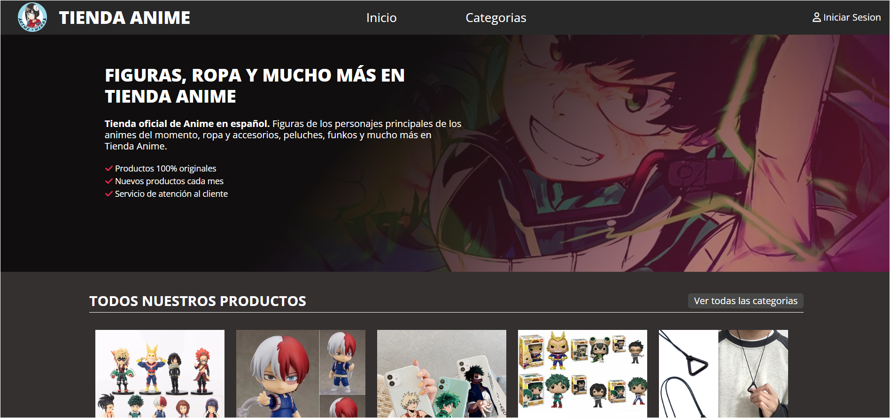
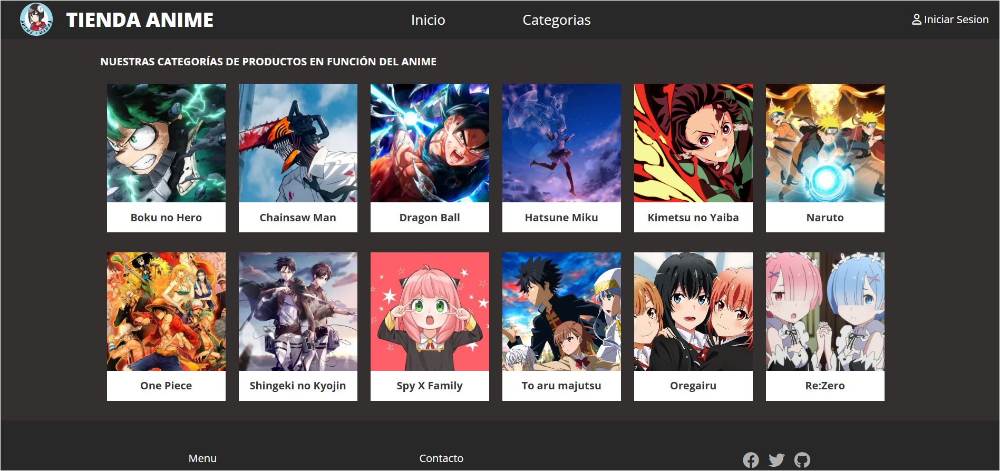
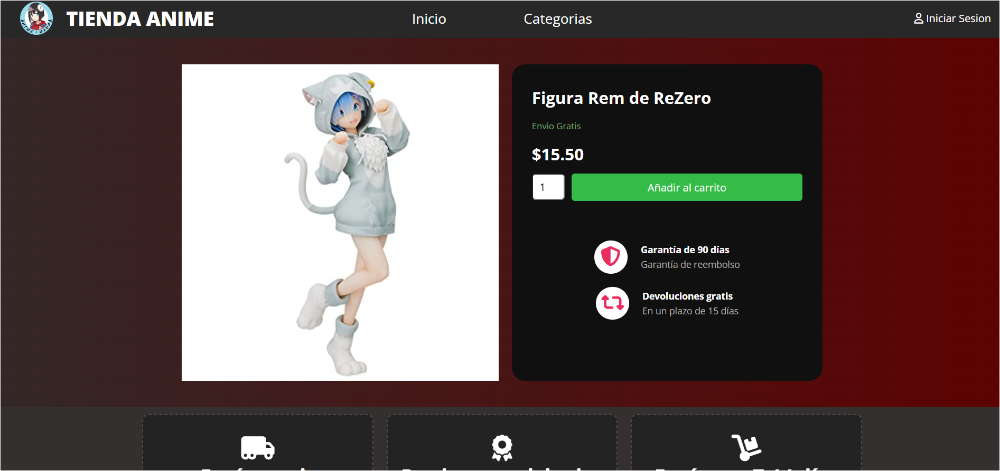
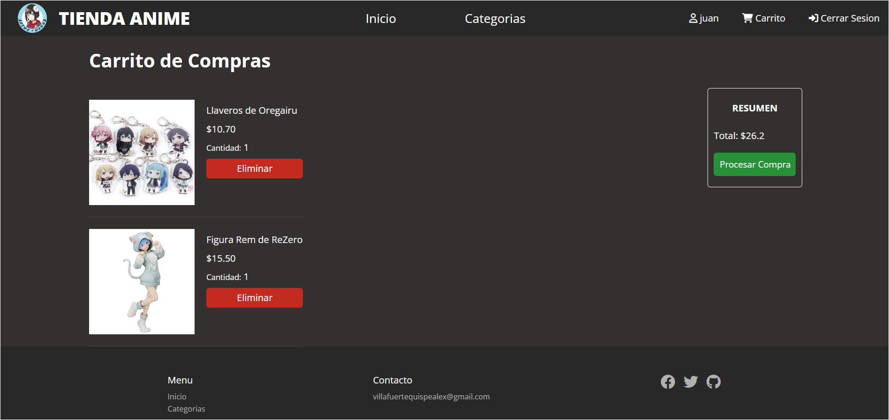
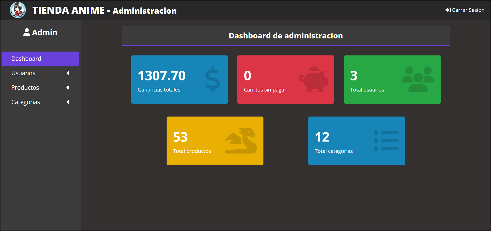

# 🏪 Tienda Anime 

Una tienda virtual de productos de anime desarrollada con PHP, MySQL y JavaScript. Permite a los usuarios comprar productos relacionados con anime como figuras, ropa y accesorios.







## ✨ Características

- 🛍️ Catálogo de productos organizados por categorías de anime
- 🛒 Carrito de compras
- 💳 Integración con PayPal para pagos
- 👤 Sistema de registro y autenticación de usuarios
- 📱 Diseño responsive
- ⚡ Operaciones AJAX para mejor experiencia de usuario
- 🔐 Panel de administración para gestionar:
  - Productos
  - Categorías  
  - Usuarios
  - Ventas

## 🛠️ Tecnologías

- PHP 8.1
- MySQL 
- JavaScript
- HTML5
- CSS3
- PayPal REST API
- SweetAlert2

## 📋 Requisitos

- PHP >= 8.1
- MySQL/MariaDB
- Servidor web (Apache/Nginx)
- Cuenta de PayPal Developer

## 🚀 Instalación

1. Clona este repositorio:
```bash
git clone https://github.com/avillaq/Tienda-Anime.git
```

2. Importa la base de datos:
```bash
mysql -u root -p < animetienda.sql
```

3. Configura las variables de entorno copiando `.env.example` a `.env`:
```bash
cp .env.example .env
```

4. Configura las siguientes variables en el archivo `.env`:
```bash
DB_HOST=localhost
DB_USER=root 
DB_PASS=tu_password
DB_NAME=tiendaanime

PAYPAL_CLIENT_ID=tu_client_id
PAYPAL_CLIENT_SECRET=tu_client_secret
PAYPAL_MODE=sandbox
```

## 👥 Usuario por defecto
- **Usuario**
  - Usuario: juan
  - Contraseña: juan

## 📄 Licencia
Este proyecto está bajo la Licencia MIT - mira el archivo `LICENSE` para detalles

## ✍️ Autor
Alexander VQ - [@avillaq](https://github.com/avillaq)
